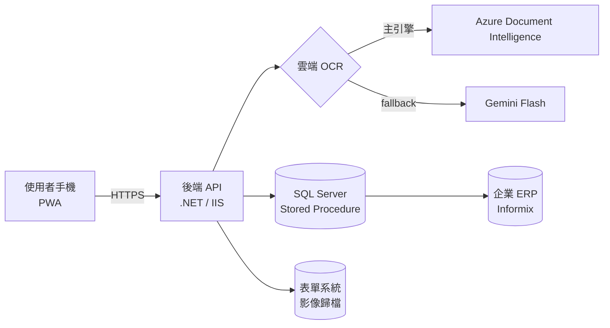

<!--
  IQC Portfolio README — v2（2026-06-08）
  ⚠ 去識別化檢查清單（推上 public 前務必再過一遍）：
     □ 無內網 IP（172.16.x）  □ 無 CA 名稱  □ 無 SP / DB 物件名
     □ 無 DB 帳號密碼  □ 無公司名  □ 截圖遮掉真實單號 / 公司資訊
  【待你補：xxx】= 需要你填真實數據或截圖的地方
  立場說明：本文誠實呈現「AI-augmented」協作——AI（Claude）負責執行，
            我負責需求、架構、風險、除錯方向與最終把關決策。
-->

# 進貨單據數位化與稽核佐證 PWA

> 一人從需求到 production 獨立交付的企業內部行動應用：把 **ESG 稽核**所需的進貨單據（發票 ＋ 收貨單），從人工蒐集、核對、歸檔，變成「**拍照 → 雲端 OCR 辨識 → 號碼交叉比對 → 綁定歸檔**」的數位流程。
>
> 稽核情境對單據的**精準度與可追溯性要求是不同級別**——一張對不上或漏歸檔就是稽核缺失——這也決定了系統的設計重心（人工確認關卡 ＋ 雙號碼交叉比對）。

<!-- 【待你補：1–2 張去敏化截圖（首頁 / 拍照頁）放最上面最吸睛】 -->

---

## TL;DR

- 🎯 **端到端獨立交付**：需求訪談 → 架構 → 全棧開發 → production 部署 → 真實使用者，一人完成
- 🧩 **6 個技術環節整合**：PWA 前端 · .NET 後端 · SQL Server · Informix 系 ERP · 雲端雙 OCR · 內網 PKI/TLS
- 🚀 **真實落地**：上線 production，供 ESG 稽核實際使用（非 demo、非教學練習）
- 🤖 **AI-augmented 協作**：我主導需求／架構／風險／**除錯方向與把關決策**，由 AI（Claude）執行
- 🔍 **硬核除錯**：用證據而非猜測定位問題、看穿自動化測試的假象、抓得掉 AI 寫的程式碼裡的隱藏 bug

---

## 問題背景（Problem）

企業的 **ESG 稽核**需要提供進貨相關的單據影像佐證（發票、收貨單）。原本仰賴人工蒐集、核對、歸檔——耗時、易錯，而且在稽核情境下，**一張單據對不上或漏歸檔，就是稽核缺失**。

與一般「報帳」相比，稽核對**資料精準度與可追溯性**是不同級別的要求。這個前提，直接決定了系統的設計重心：不是「能掃就好」，而是「**必須掃對、且能交叉驗證**」。

<!-- 【待你補：量化痛點 — 原本一張單約幾分鐘？每次稽核要整理幾份？讓讀者感受到規模】 -->

---

## 解決方案（Solution）

**流程**：拍收貨單 ＋ 拍發票 → 雲端 OCR 擷取兩張單號 → **人工確認關卡** → 後端**比對「收貨單號 ↔ 發票號」** → 綁定 ERP 收貨單 → 影像歸檔。

> 「人工確認 ＋ 雙號碼交叉比對」這兩道關卡，正是為了滿足稽核對精準度的要求——OCR 可能誤判（例如 `I`/`1` 混淆），所以不讓機器獨自拍板。

### 系統架構

### 技術棧

| 層 | 技術 |
|---|---|
| 前端 | PWA（manifest / ServiceWorker / 離線）, Vanilla JS, Camera API, 圖片壓縮 |
| 後端 | .NET (C#), IIS, `.ashx` HTTP handlers |
| 資料 | SQL Server（Stored Procedure）, Informix 系 ERP 整合 |
| 雲端 AI | Azure Document Intelligence, Google Gemini（fallback） |
| 基礎建設 | 企業內網, HTTPS, 內部 CA / PKI |

---

## 工程亮點與關鍵決策（Engineering Highlights）

### 1. 雙 OCR 引擎 ＋ 自動 fallback
主引擎用 Azure DI（免費額度控成本），偵測到配額耗盡 / 限流（HTTP 403 / 429）時**自動切換 Gemini**，確保服務不中斷。

### 2. 為「稽核精準度」而設計的雙重關卡
OCR 不是 100% 可靠（會 `I`/`1` 混淆），但稽核不容許錯。因此設計**人工確認關卡** ＋ 後端**收貨單號↔發票號交叉比對**，用流程設計補上機器辨識的不確定性。

### 3. 風險取捨——知道「何時不做」
- 為了 App 圖示美觀，需動到企業 CA 的全域簽發設定 → 評估「高風險、不可逆、無法善後」後**選擇不做**，接受次優外觀
- 設定檔加密判斷「現階段（小規模內測）效益有限」→ **延後**到正式擴大前
> 工程成熟度不只在「能做什麼」，也在「判斷什麼不該做」。

---

## 踩坑與根因分析（War Stories）

> 這個專案以 AI 協作方式開發：**AI（Claude）負責寫程式與執行，我負責判斷方向、把關品質、做最終決策**。以下三個故事，正好是這種協作模式裡「人該扮演什麼角色」的實例。

### 🐛 War Story 1：把「一直猜」換成「先拿證據」

**情境**：後端 .NET API 部署到 IIS 後，瀏覽器只回一個**沒有任何細節的 500 錯誤頁**——看不出哪裡壞了。

**問題**：一開始 Claude 往「是不是 `web.config` 哪裡寫壞了」的方向反覆修改，改了好幾輪都沒用，時間一直燒。

**我怎麼介入**：我判斷「這樣猜下去沒完」，喊停並換方向——要求**先拿到 IIS 的 detailed error**（IIS 預設只在 localhost 訪問時才吐詳細錯誤）。拿到真正的錯誤訊息後，連環定位出三個各自獨立的真因：
1. 部署時 `web.config` 被覆蓋，把裡面的密鑰清成了佔位符
2. 用 PowerShell 寫含中文的設定檔時編碼沒處理好，把 XML 註解寫壞 → IIS parser 直接拒收（500.19）
3. C# 反序列化雲端 JSON 時的型別誤判（詳見 War Story 3）

**收穫**：我把這次教訓固化成一條固定紀律——**遇到 5xx 先拿 detailed signal 再動手；同一問題連續幾次沒解，就停下來重新檢視方向，而不是換個地方繼續猜。**

> 💡 在 AI 協作開發裡，AI 很會執行，但會陷在局部反覆嘗試。判斷「該停、該換方向、該先拿證據」——這是**我**的職責，也是這次最大的價值。

### 🐛 War Story 2：自動化測試全綠，真機卻掛——看穿覆蓋率的假象

**情境**：前端要在手機上拍照上傳，我們用 Playwright 自動化測試驗證流程。

**問題**：自動化測試**全部通過**，但一到 iPhone 真機，拍完照就沒反應、上傳沒被觸發。

**我怎麼介入**：我不接受「自動化綠燈 = 沒問題」，堅持要真機實測。一路逼出根因：自動化測試用的 mock **繞過了 iOS 對相機 `file input` 的真實行為**——真機上某個事件被重複觸發、把流程打斷了，而 mock 環境根本碰不到這條路徑。

**收穫**：確立「**render 級 / 真機驗證不可省**」——自動化測試的價值上限，取決於它有沒有覆蓋到真實環境的行為。綠燈只代表「測到的都過」，不代表「沒問題」。

> 💡 對「測試覆蓋的假象」有警覺，是踩過坑才長得出來的判斷。

### 🐛 War Story 3：抓出 AI 寫的程式碼裡的隱藏 bug

**情境**：後端要解析雲端 OCR 服務回傳的 JSON。

**問題**：Claude 寫的 C# 用 `someValue as List<object>` 來取陣列——語法完全合法、編譯也過，但**執行時永遠得到 null**。因為 .NET 的 `JavaScriptSerializer` 實際回傳的是 `object[]`，不是 `List<object>`，這個轉型**靜默失敗、不報錯**。

**我怎麼介入**：這種 bug **光看 code review 看不出來**（語法沒錯），是實際跑起來才現形。我抓到後判斷：這是 AI 對特定函式庫（.NET BCL 反序列化）行為的盲點。

**收穫**：**AI 產出的程式碼不能無腦接受**，尤其涉及特定 runtime / library 的細節行為時，一定要實測把關。

> 💡 這直接呼應我的開發方式——**我用 AI 放大產出，但我看得出、也抓得掉 AI 的盲點**。這才是「會用 AI」的真正意思。

---

## 我的角色與開發方式（Role & Process）

這個專案我以 **AI-augmented** 的方式開發：

- **我主導**：需求訪談與釐清、系統架構與技術選型、風險評估與取捨、**除錯方向判斷、最終把關與決策**
- **AI（Claude）執行**：以 multi-agent 工序鏈（架構 → 實作 → 審查 → 驗收）產出與交叉審查程式碼，搭配 render 級自動化測試

> 我認為 2026 年工程師的核心價值，正從「親手寫每一行」轉向「**定義對的問題、判斷對的方向、駕馭 AI 放大產出並把關品質**」。上面三個 War Story，就是這套工作方式的實證。

---

## 成果（Impact）

- ✅ 上線 production，供 **ESG 稽核**實際使用
- ✅ 把稽核佐證單據的蒐集與歸檔數位化，降低人工核對成本與漏件風險
- 🚀 公司內部第一個行動裝置應用，從需求到上線一手完成
<!-- 【待你補：量化 impact — 整理一次稽核單據從 X 變 Y、每次處理 N 份、漏件/錯誤下降…有數字才有說服力】 -->

---

## 截圖 / Demo

<!-- 【待你補：去敏化截圖，建議首頁 / 拍照流程 / 結果頁；遮掉真實單號與公司資訊】 -->

---

> 本專案為企業內部系統，所有截圖與說明均已去識別化，不含真實內網位址、憑證、資料庫物件與業務資料。
