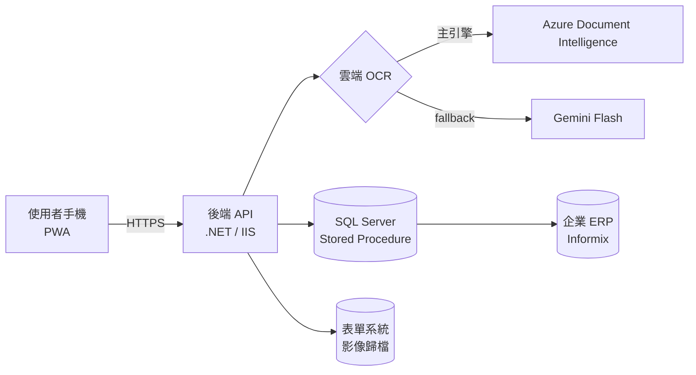

<!--
  IQC Portfolio README — 草稿 v1（2026-06-08）
  ⚠ 去識別化檢查清單（推上 GitHub 前務必再過一遍）：
     □ 無內網 IP（172.16.x）  □ 無 CA 名稱  □ 無 SP / DB 物件名
     □ 無 DB 帳號密碼  □ 無公司名  □ 截圖遮掉真實單號 / 公司資訊
  【待你補：xxx】= 需要你填真實數據或截圖的地方
-->

# Invoice Capture & OCR PWA｜進貨檢驗發票數位化系統

> 一人從需求到 production 獨立交付的企業內部手機系統：把進貨檢驗（IQC）的發票報帳，從「人工貼單」變成「**拍照 → 雲端 OCR 自動辨識 → 比對 ERP 收貨單 → 影像歸檔**」的端到端流程。

<!-- 【待你補：1–2 張去敏化截圖（首頁 / 拍照頁）放最上面最吸睛】 -->

---

## TL;DR

- 🎯 **端到端獨立交付**：需求訪談 → 架構 → 全棧開發 → production 部署 → 真實使用者，一人完成
- 🧩 **6 個技術環節整合**：PWA 前端 · .NET 後端 · SQL Server · Informix 系 ERP · 雲端雙 OCR · 內網 PKI/TLS
- 🚀 **真實落地**：部署於企業內網 production，真實使用者日常使用（非 demo / 非教學練習）
- 🤖 **AI-augmented 開發**：主導需求 / 架構 / 風險 / 除錯 / 驗收，以 AI agent 放大執行
- 🔍 **硬核除錯**：證據驅動，診斷出 iOS 端一個連桌機都驗不出的 TLS 憑證根因

---

## 問題背景（Problem）

某製造業企業的進貨檢驗（IQC）報帳流程，原本仰賴人工：驗收人員把供應商發票與收貨單**人工核對、貼單、輸入、歸檔**。痛點：耗時、易錯、紙本影像難以後續查找。

<!-- 【待你補：量化痛點 — 原本一張單約幾分鐘？每月約幾張？讓讀者感受到規模】 -->

---

## 解決方案（Solution）

**流程**：拍收貨單 ＋ 拍發票 → 雲端 OCR 擷取兩張單號 → 人工確認關卡 → 後端比對「收貨單號 ↔ 發票號」→ 綁定 ERP 收貨單 → 影像歸檔到企業表單系統。

### 系統架構

### 技術棧

| 層 | 技術 |
|---|---|
| 前端 | PWA（manifest / ServiceWorker / 離線）, Vanilla JS, Camera API, 圖片壓縮 |
| 後端 | .NET (C#), IIS, `.ashx` HTTP handlers |
| 資料 | SQL Server（Stored Procedure）, Informix 系 ERP 整合 |
| 雲端 AI | Azure Document Intelligence, Google Gemini（fallback） |
| 基礎建設 | 企業內網, HTTPS, 內部 CA / PKI |

---

## 工程亮點與關鍵決策（Engineering Highlights）

### 1. 雙 OCR 引擎 ＋ 自動 fallback
主引擎用 Azure DI（免費額度控成本），偵測到配額耗盡 / 限流（HTTP 403 / 429）時**自動切換 Gemini**，確保服務不中斷。
<!-- 【可補：配額守護怎麼設計的、為什麼選這兩個引擎】 -->

### 2. PWA ＋ 年長使用者 UX
免安裝、加主畫面即用；針對年長使用者刻意設計：大字級、大觸控區、強制拍照流程引導、誤觸逃生機制。

### 3. 風險取捨 —— 知道「何時不做」
- 為了 App 圖示美觀，需動到企業 CA 的全域簽發設定 → 評估「高風險、不可逆、無法善後」後**選擇不做**，接受次優外觀
- 設定檔加密判斷「現階段（小規模內測）效益有限」→ **延後**到正式擴大前
> 工程成熟度不只在「能做什麼」，也在「判斷什麼不該做」。

---

## 踩坑與根因分析（War Stories）

### 🐛 iOS PWA 圖示異常 → 一路挖到 TLS 憑證 SHA-1
**現象**：iOS 加入主畫面後圖示變成系統 fallback、網址列顯示「不安全」，但桌機一切正常。

**診斷（證據驅動，逐一否決假設）**：
1. 直接開圖檔 URL → 正常顯示 → 排除檔案 / 網路問題
2. 假設「CA 未信任」→ 實機確認信任已開 → **否決**
3. 抓 server 憑證：SAN、有效期、EKU 全正常 → **否決 SAN / 過期假設**
4. 再深一層 → **簽章演算法是 SHA-1**

**根因**：iOS 13+ 一律拒絕 SHA-1 簽章的 TLS 憑證 → ServiceWorker 無法註冊、系統層圖示抓取被拒。**桌機 / Windows 對 SHA-1 寬容，所以「桌機能連」反而誤導人。**

**收穫**：「能瀏覽 ≠ 憑證受信任 ≠ PWA 能完整運作」；跨平台的嚴格度差異會製造假象，必須拿到底層 signal 才能定位，不能靠猜。

### 🐛 真機 vs 自動化測試的盲區
自動化測試（Playwright）全綠，真機卻掛 —— mock 繞過了 iOS 對相機 `file input` 的真實行為。
**收穫**：對「測試覆蓋的假象」要有警覺；render 級 / 真機驗證不可省。

---

## 我的角色與開發方式（Role & Process）

這個專案我以 **AI-augmented** 的方式開發：

- **我主導**：需求訪談與釐清、系統架構與技術選型、風險評估與取捨、除錯方向判斷、最終驗收
- **AI 放大執行**：以 multi-agent 工序鏈（架構 → 實作 → 審查 → 驗收）產出與交叉審查程式碼，搭配 render 級自動化測試把關

> 我認為 2026 年工程師的核心價值，正從「親手寫每一行」轉向「**定義對的問題、做對的決策、駕馭 AI 放大產出並把關品質**」。這個專案是我這套工作方式的實證。

---

## 成果（Impact）

- ✅ 部署於 production，真實使用者日常使用
- 🏆 企業第一個 自家主導開發的手機端應用
<!-- 【待你補：量化 impact — 報帳時間 X 分 → Y 分、每月處理 N 張、錯誤率下降…有數字才有說服力】 -->

---

## 截圖 / Demo

<!-- 【待你補：去敏化截圖，建議首頁 / 拍照流程 / 結果頁；遮掉真實單號與公司資訊】 -->

---

> 本專案為企業內部系統，所有截圖與說明均已去識別化，不含真實內網位址、憑證、資料庫物件與業務資料。
