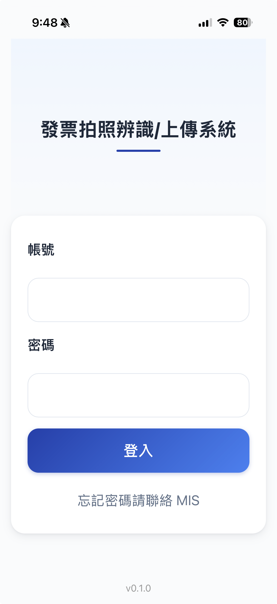
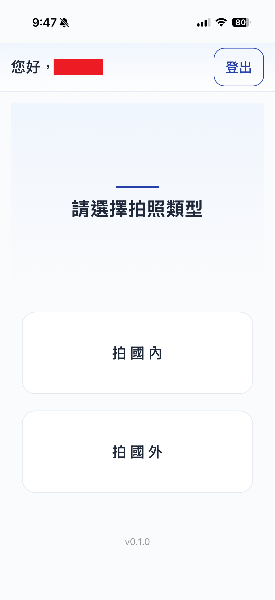
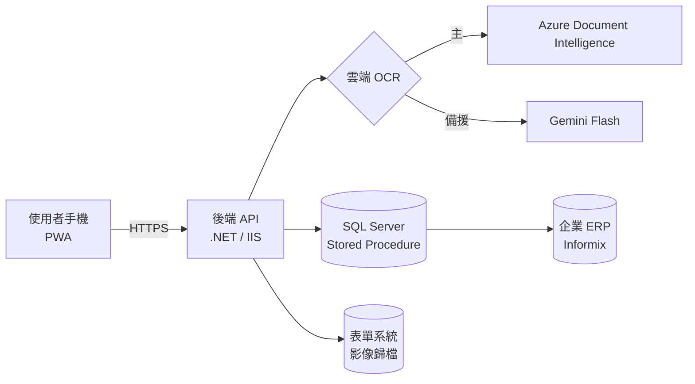

<!--
  IQC Portfolio README — v5（2026-06-09）
  原則：樸實、準確、不堆術語、不誇大規模；真實的強項如實寫，做不到的不裝。
  ⚠ 去識別化檢查清單（推上 public 前再過一遍）：
     □ 無內網 IP  □ 無 CA 名稱  □ 無 SP/DB 物件名  □ 無公司名  □ 截圖已遮敏感資訊
  v5：整合真實截圖（assets/）、詳細流程、量化數據（4–5 分 → 30 秒）。
-->

# 進貨單據數位化工具（ESG 稽核用）

> 獨立交付的一個企業內部小工具：讓使用者用手機拍進貨單據（發票＋收貨單），自動辨識單號、跟 ERP 收貨單對上、把影像歸檔，供 ESG 稽核調閱。

  
  &nbsp;&nbsp;
  

**先把規模說清楚**：這是內部使用、使用者不多、低併發的工具，不是高併發或分散式系統。它的價值不在技術多難，而在於——**把一個真實的人工痛點，在公司既有的老舊環境裡，整合多種現成工具、完整交付上線。**

---

## 這是什麼 / 不是什麼

- ✅ **是**：端到端可用、已上 production、解決真實稽核痛點的內部工具
- ✅ **是**：一次「在企業既有約束下（老舊 Server、內網、ERP、憑證）把東西整合到能跑」的整合工程
- ❌ **不是**：高併發 / 分散式 / 需要底層效能調優的系統——它不需要，硬套那些只是過度設計

---

## 問題

企業 ESG 稽核需要提供進貨單據（發票、收貨單）的影像佐證。原本人工蒐集、核對、歸檔——耗時、易錯，且稽核情境下一張對不上或漏歸檔就是缺失。目標是把這段流程數位化，並且**確保掃進來的單據是對的、能跟 ERP 對得上**。

---

## 流程與架構

> 手機連公司內網 Wi-Fi → 登入員工帳號 → 拍收貨單 ＋ 拍發票 → **使用者可旋轉並確認照片** → 雲端 OCR 辨識兩張單號 → 人工確認 → 後端比對「收貨單號 ↔ 發票號」→ 綁定 ERP 收貨單 → 影像歸檔。

| 層 | 技術 |
|---|---|
| 前端 | PWA, Vanilla JS, Camera API, 圖片壓縮 |
| 後端 | .NET (C#), IIS, `.ashx` |
| 資料 | SQL Server（Stored Procedure）, Informix 系 ERP |
| 雲端 | Azure Document Intelligence（主）, Gemini（備援） |
| 基礎建設 | 企業內網, HTTPS, 內部 CA |

---

## 我實際處理的問題（不是演算法難題，是工程現實）

這個專案的難度不在商業邏輯，而在「**把多個現成元件，在一個有不少現實限制的企業環境裡兜起來、並處理它們各自的坑**」：

1. **OCR 會認錯字，但稽核不容錯**
   雲端 OCR 偶爾把 `I` 認成 `1`。所以我沒讓機器獨自拍板——加了人工確認，加上後端拿「收貨單號 ↔ 發票號」交叉比對。用流程補上機器辨識的不確定性。

2. **部署環境是 Windows Server 2008**
   原本想用 Python，環境跑不動 → 改用 .NET 重做後端。老舊環境的相容性是這類內部專案的常態。

3. **內網 HTTPS / 憑證的坑（我覺得最值得寫的一段）**
   iOS 上 PWA 圖示一直顯示不出來、瀏覽器標「不安全」，但桌機一切正常。我沒有亂改設定，而是一層層抓伺服器憑證內容，最後確認根因是 **伺服器的 TLS 憑證用了 SHA-1 簽章，被 iOS 拒絕**（桌機對 SHA-1 較寬容，所以才會「桌機能連、iOS 掛」）。
   正解是重簽憑證——但這需要改公司 CA 的全域簽發設定。我評估那是**高風險、不可逆、我無法完全善後**的操作，於是選擇不動它、接受次優結果（圖示用系統預設）。
   > 我把「能查到根因」和「知道哪些公司基礎設施不該硬碰」都算進工程判斷——後者尤其是在企業環境工作的人該有的分寸。

---

## 怎麼開發的（誠實說：大量靠 AI 協作）

我不假裝這些 code 是我一行行手寫的——**絕大部分由 AI（Claude）產出，我負責需求釐清、技術選型、系統整合、除錯方向、最終把關與驗收。**

過程中累積了一些用 AI 協作的務實心得，但我也不想誇大它們：
- 讓 AI 用不同角色（設計 / 實作 / 審查）多看幾輪，**能攔下一些單次會漏的問題**——但底層是同一個模型，有共同盲點，不是萬靈丹。
- AI 說「測過了」不能盡信，UI 我會自己再用截圖核對。也因此踩到一個坑：**自動化測試環境繞過了 iOS 相機的真實行為，差點漏掉真機才會出現的問題**——這提醒我，自動化測不能取代真機（這本來就是 mobile web 的基本功，我是補課補回來的）。

---

## 我的定位（誠實）

一句話：**我擅長在真實的企業約束下，整合現有工具（包含 AI），把一個業務問題端到端交付上線。**

我不是底層效能、分散式架構的專家，這個專案也不需要。我的價值在「**把事情整合到能用、能上線、解決真問題**」，以及「**懂得在公司既有環境裡，什麼能碰、什麼不該碰**」。

---

## 成果

- 🚀 上線 production，供 ESG 稽核實際使用
- ⏱️ **單據處理時間從 4–5 分鐘 縮短到 30 秒內**（手機操作取代人工核對歸檔）
- 把人工蒐集／核對／歸檔的流程數位化

> 作業模式為「發票隨到隨入」、量分散，因此刻意**不做批量處理**——避免為了不存在的規模做過度設計。

---

> 本專案為企業內部系統，所有說明均已去識別化，不含真實內網位址、憑證、資料庫物件與業務資料。
